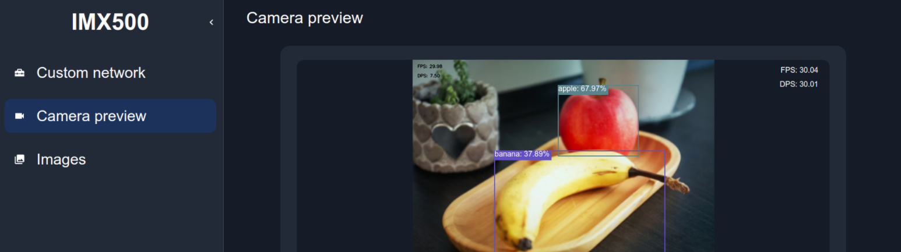

<div align="center">
  <p>
    <a align="center">
      
    </a>
  </p>

</div>

# GUI Tool - Quickstart 👋

The IMX500 GUI Tool is a user-friendly graphical interface designed to interact with the IMX500 Intelligent Vision Sensor. It allows users to deploy a custom network and visualize the output of the chosen model superposed to the camera preview.

## Prerequisites 🔧

Before getting started, ensure you have the following prerequisites installed on your system:

1. **Node.js**

Node.js is required to run this application. Download and install the latest version from [nodejs.org](https://nodejs.org/).
To verify your Node.js installation, run the following command in your terminal:
```
node --version
```

2. **UV**

UV is the Python environment and package manager used for the project. Follow the installation instructions provided in the [UV documentation](https://docs.astral.sh/uv/getting-started/installation/) to set it up.
Verify your uv installation by running:
```
uv --version
```

## Starting the GUI Tool 🚀

Navigate to the project directory and build the project by running:

```bash
make setup
```

To start the GUI Tool, run:

```bash
uv run main.py
```

After starting the GUI Tool, we recommend to open the GUI Tool from a PC on the same network as your Raspberry Pi. Open a web browser on your PC and enter the URL `http://<your-raspberrypi-IP-address>:3001`.  
> TIP: To find your Raspberry Pi's IP address, run the command `hostname -I | awk '{print $1}'` in the terminal on the Raspberry Pi.  

Alternatively, you can access the GUI Tool from `http://127.0.0.1:3001` by forwarding port `3001` to `localhost:3001`.


## Quickstart Guide 

### Download models from the Zoo

The easiest way to get started is to download the models available in theIMX500 Raspberry Pi [Model Zoo](https://github.com/raspberrypi/imx500-models). Download them into your model list by clicking on the `DONWLOAD ZOO` button in the custom network tab. Choose one of your added networks and in the left sidebar and click on `Camera preview` to see the model in action through the camera preview interface!

### Adding a Custom Model

1. Click on the `ADD` button located at the top right corner of the interface.
2. Provide the necessary details to add a custom network.
3. Upload the network file, and the (optional) `labels.txt` file.


## Features

| Feature                                      | Available |
|----------------------------------------------|-----------|
| Camera preview (VGA Image)                   | ✔️        |
| Camera preview (input tensor)                | ✔️        |
| Capture images & Dataset collection          | ✔️        |
| AI task visualization: Classification        | ✔️        |
| AI task visualization: Object Detection      | ✔️        |
| AI task visualization: Pose Estimation       | ✔️        |
| AI task visualization: Segmentation          | ✔️        |
| AI task visualization: Anomaly Detection     | ✔️        |
| Input Tensor Cropping                        | ✔️        |
| IMX500 Raspberry Pi Model Zoo                | ✔️        |
| Custom models (KERAS, ONNX & Converting & Packaging) | ✔️        |

## Development Environment Setup 🙇

1. **Start the application components**:
    Before starting the different components make sure to create a `.env`-file in the root of this repository and provide the following variables.
    ```
    SERVER_HOST=0.0.0.0
    SERVER_PORT=3001
    LOG_LEVEL=info
    REACT_APP_BACKEND_HOST=http://0.0.0.0:3001
    ```

    Afterwards you are ready to start the following components:
    - **Frontend** (in one terminal)
    ```bash
    make frontend
    ```
    - **Backend** (in another terminal)
    ```bash
    make backend
    ```
    - **Client** (in a third terminal)
    ```bash
    make client
    ```

2. **Check code quality**:
   ```bash
   make lint
   ```

3. **Clean up the environment**:
   ```bash
   make clean
   ```

## License

[LICENSE](./LICENSE)

## Notice

### Security

Please read the Site Policy of GitHub and understand the usage conditions.